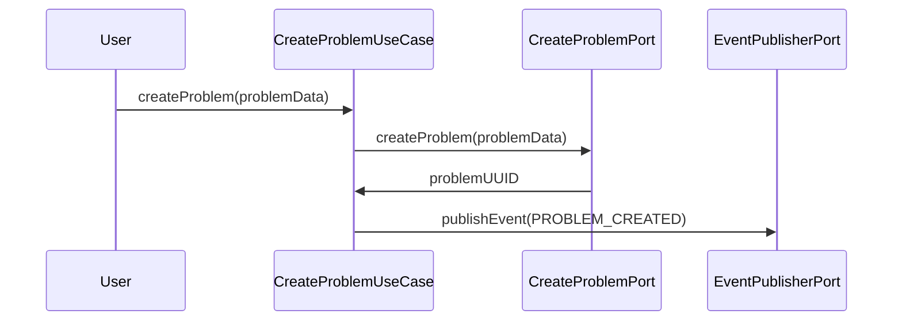

# committee
Committee Management System

## kata
Problems are topics that are dealt with in committees.
A problem has a name and begins by being opened.
Then, when a comment has been added, it's ready to be added to a committee.

A committee is programmed in advance with a date and comprises several problems that will be dealt with during the committee session.
Problems can also be added to the committee via the committee.
Once a committee has started, it is in progress.
When the committee is finished, the director close the committee, and all problems on the agenda are closed.

 ## sequence diagram
 ### diagram to exemplify the use case create a problem

